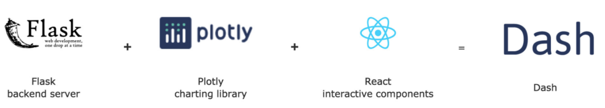
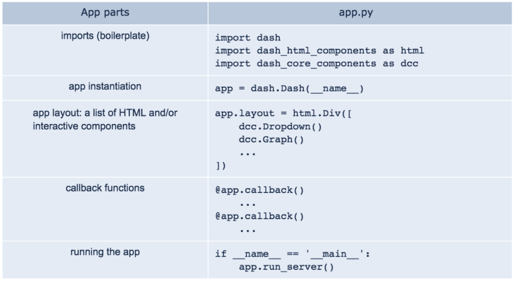
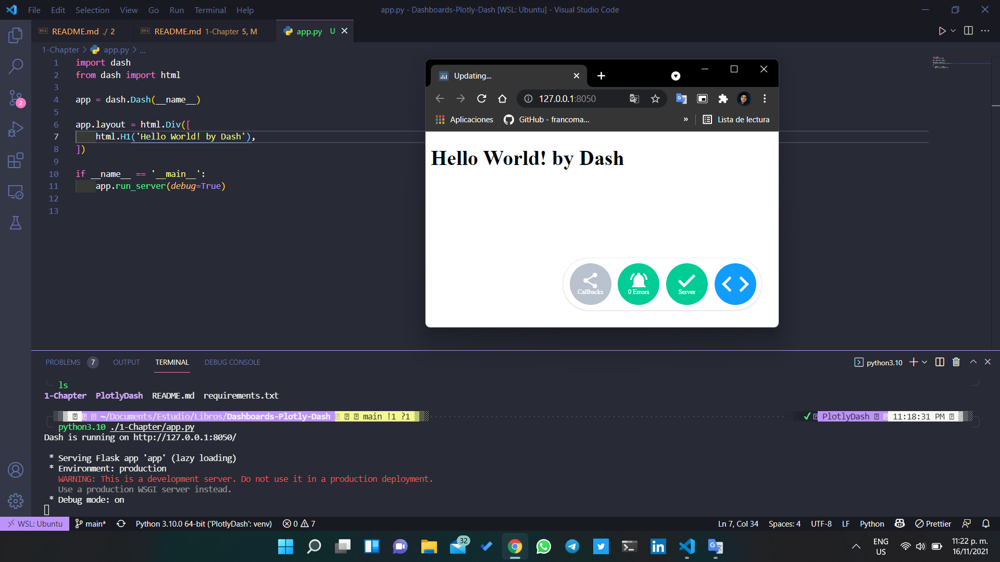
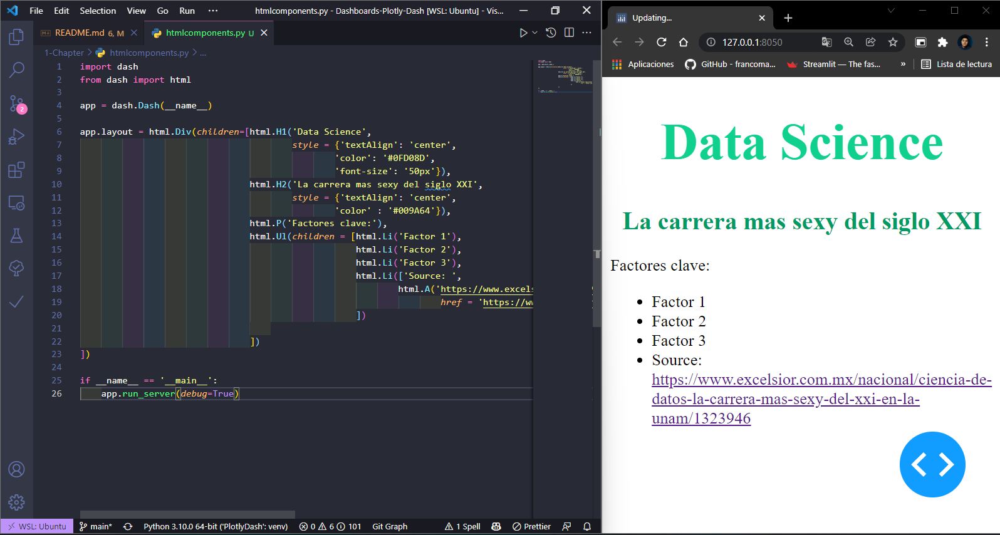

# En esta seccion se estudiara el uso de **Dash, Dash HTML Components y Dash Boostrap**

## Topic covered

- Exploring Dash and other supporting packages
- Creating and running the simplest app
- Adding HTML and other components to the app
- Learning how to structure the layout and managing themes.

Una de las constantes en al rededor del mundo de los datos son: los crecientes cambios de donde obtenemos los datos, y los tipos de datos que se tratan. 

El poder unir estos datos y explorarlos es crucial. Dash no solo se puede ocupar en la exploracion de los datos, si no que tambien puede ser usado en la mayoria de las faces del proceso de analis de datos, desde la exploracion hasta la produccion de anvientes operacionales.

## Dash y otros paquetes de soporte 

Una de las principales ventajas de usar Dash es que podemos crear completamente nuestras propias aplicaciones de datos iteractivos de analitica y visualizacion de datos sin tener conocimiento de html, css, javascript.

Como se puede ver en la figura Dash utiliza como backend Flask, para producir graficos usa Plotly, y para el renderizado de los graficos usa react.

## Los diferentes paquetes que tiene Dash

Dash no es una gran libreria donde contenga todas las funcionalidades, en su lugar tiene una gran cantidad de paquetes, cada uno para un cierto tipo de funcionalidad.

Los siguientes son los paquetes mas utilizados en este proyecto de introduccion a Dash:

- Dash: El paquete principal y su objeto es dash.Dash y nos proporciona algunas herramientas para manejar la interactividad y las esepciones 
- Dash Core Components: Contine los componentes basicos para el desarrollo de Dash, como los botones, filtros, sliders, etc.
- Dash HTML Components: Es basicamente un traductor de codigo Python a HTML.
- Dash Bootstrap Components: Contiene las funcionalidades para cuidar los aspectos visuales de los componentes.

## Entendiendo la estructura general de Dash Apps

La estructura general de una aplicacion de Dash es: 

- Imports: como cualquier otra libreria en python debemos declararla al principio de nuestro codigo usando los alias de las librerias.
- App Instantiation: creamos la instancia de la app, y de uana forma sencilla se le pasa como parametro ___ name ___
- App Layout: El tema de este capitulo es este y se centra en la configuracion de los elementos hacia el ususario que usualmente se define con html.Div
- Callback Functions: Las funciones que se ejecutan cuando se produce un evento, como el click en un boton, o el cambio de un slider, etc. Esto se ve en la proxima seccion.
- Running the App: Finalmente se ejecuta la aplicacion.

## [Creando una aplicacion de Dash](./app.py)

Como podemos ver el primer hello world de Dash es una aplicacion sencilla, que solo muestra un mensaje en la ventana del navegador, pero esta misma sencilles hace que dash sea una herramienta muy poderosa para el desarrollo de aplicaciones de datos.

Ahora que tenemos un entendimiento basico de la estructura de una app de dash podemos continuar con la siguiente seccion.

## Adding HTML and other components to the App

Ahora nos enfocaremos en ***app.layout***  que es el atributo que define la estructura de la aplicacion.

Para añadir componentes a la aplicacion, simplemente debemos añadir *html.Div* en una lista de elementos (con el parametro children) que se encuentra en el atributo layout de la app.

~~~python
html.Div(children = [component_1, component_2, ...])
~~~

### HTML components

Dado que los componentes disponibles en el paquete corresponden a HTML tags, este es el paquete mas estable dentro de Dash.

Los componentes mas importantes y que mas usaremos son:

- **children**: es una lista de elementos que se encuentran dentro de un componente, y es el primer contenedor de contenido de componentes.
- **className**: este es el mismo atributo que class en html, pero es un atributo de Dash.
- **style**: es un atributo de Dash que permite definir estilos de los componentes.
- **id**: es un atributo de Dash que permite definir un identificador para los componentes, y es el encargado de que hacer que la interactividad de los componentes funcione(de momento no se revisara a fondo), de momento solo sabremos que es capas de asignar arbitrariamente ID's en los componentes para poder identificarlos y manejar posteriormente la interactividad.

## [Probando HTML components](./htmlcomponents.py)

Podemos notar que usamos los componentes basicos de HTML, como "p" para crear un parrafo, "ul" para crear una lista, "li" para crear un elemento de la lista, "a" para crear un enlace, etc.

Notemos que estos componentes simplemente estan implementados como classes en python:

~~~python
html.P , html.Ul , html.Li , html.A
~~~
